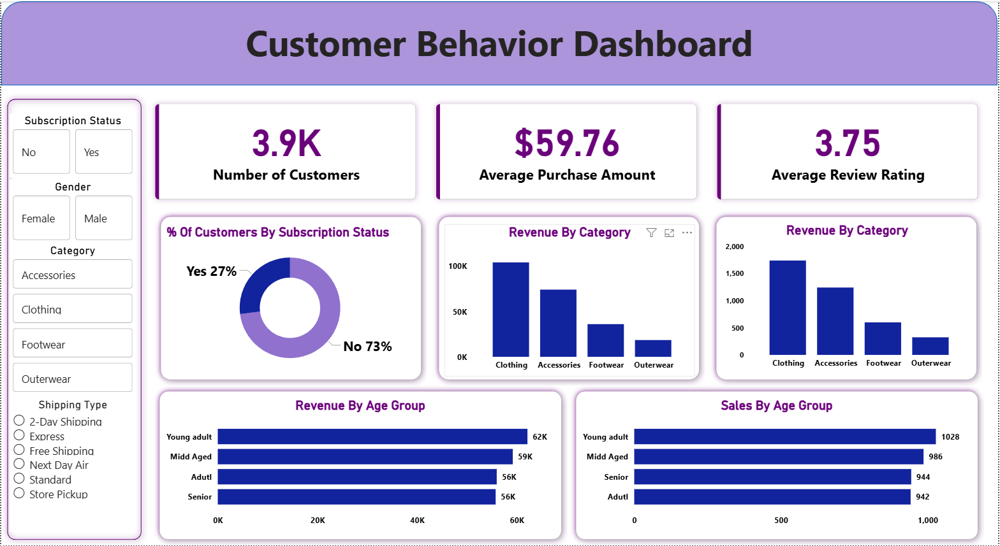

# 🛒 Customer Shopping Behavior Analysis | End-to-End Data Analytics Project


---

# 📌 Project Overview

This project demonstrates a complete **End-to-End Data Analytics Workflow** using **Python**, **PostgreSQL**, and **Power BI**.

The objective is to analyze customer shopping behavior from transactional data, transform raw data into meaningful business insights, and present those insights through an interactive Power BI dashboard.

The project covers the complete analytics lifecycle including:

* Data Cleaning
* Exploratory Data Analysis (EDA)
* Feature Engineering
* SQL Business Analysis
* Interactive Dashboard Development
* Business Recommendations

---

# 📸 Dashboard Preview

The Power BI dashboard provides an interactive overview of customer demographics, purchase behavior, subscription trends, revenue distribution, and sales performance.



---

# 🎯 Business Problem

Retail businesses collect large volumes of customer transaction data but often struggle to convert it into actionable insights.

This project helps answer important business questions such as:

* Who are the most valuable customers?
* Which product categories generate the highest revenue?
* How does subscription status affect purchasing behavior?
* Which customer age groups contribute the most revenue?
* Which shipping methods generate higher purchase amounts?
* Which products receive the highest customer ratings?

---

# 📂 Dataset Overview

| Property       | Details                                      |
| -------------- | -------------------------------------------- |
| Dataset        | Customer Shopping Behavior                   |
| Records        | 3,900 Customer Purchases                     |
| Columns        | 18                                           |
| Missing Values | Review Rating (Handled during preprocessing) |

### Dataset Features

* Customer Demographics
* Purchase Amount
* Product Category
* Item Purchased
* Gender
* Age
* Subscription Status
* Shipping Type
* Purchase Frequency
* Previous Purchases
* Discount Applied
* Review Rating
* Season
* Color
* Size

---

# 🛠️ Technologies Used

* Python
* Pandas
* NumPy
* PostgreSQL
* SQL
* Power BI
* Power Query
* DAX
* Jupyter Notebook

---

# 🐍 Python Data Preparation

Data preprocessing and exploratory analysis were performed using Python.

### Tasks Performed

* Imported dataset using Pandas
* Checked data structure
* Performed Exploratory Data Analysis
* Handled missing values
* Standardized column names
* Feature Engineering
* Created Age Groups
* Generated Purchase Frequency metrics
* Connected to PostgreSQL
* Exported cleaned data into PostgreSQL

---

# 🐘 SQL Business Analysis

Business questions were solved using PostgreSQL.

### Analysis Performed

* Revenue by Gender
* High Spending Discount Customers
* Top Rated Products
* Shipping Type Comparison
* Subscribers vs Non-Subscribers
* Discount Dependent Products
* Customer Segmentation
* Top Products by Category
* Repeat Buyers Analysis
* Revenue by Age Group

---

# 📊 Power BI Dashboard

The cleaned data was imported into Power BI to build an interactive dashboard.

### Dashboard KPIs

* 👥 Number of Customers
* 💰 Average Purchase Amount
* ⭐ Average Review Rating

### Dashboard Features

* Subscription Status Analysis
* Revenue by Category
* Sales by Category
* Revenue by Age Group
* Sales by Age Group
* Interactive Filters
* Gender Filter
* Product Category Filter
* Shipping Type Filter

---

# 📈 Key Business Insights

* Clothing generates the highest revenue among all product categories.
* Young Adult customers contribute the highest revenue.
* Most customers are non-subscribers.
* Express shipping customers have a higher average purchase amount.
* Loyal customers represent the largest customer segment.
* Top-rated products demonstrate strong customer satisfaction.
* Subscription status influences customer purchasing behavior.

---

# 💡 Business Recommendations

* Increase subscription adoption through exclusive offers.
* Reward loyal customers with personalized loyalty programs.
* Focus marketing campaigns on high-revenue age groups.
* Promote top-rated products.
* Optimize discount strategies to improve profitability.
* Encourage express shipping through promotional incentives.

---

# 🔄 End-to-End Workflow

```text
Raw CSV Dataset
        │
        ▼
Python
(Data Cleaning & EDA)
        │
        ▼
Feature Engineering
        │
        ▼
PostgreSQL
(SQL Business Analysis)
        │
        ▼
Power BI
(Dashboard & KPI Reporting)
        │
        ▼
Business Insights
```

---

# 💼 Skills Demonstrated

* Data Cleaning
* Exploratory Data Analysis (EDA)
* Feature Engineering
* Python Programming
* Pandas
* NumPy
* PostgreSQL
* SQL Queries
* Power BI
* Power Query
* DAX
* Dashboard Design
* Data Visualization
* Business Intelligence
* Business Analysis

---

# 📁 Repository Structure

```text
Customer-Behavior-Analysis
│
├── Dashboard
│   └── Customer_Behavior_Dashboard.pbix
│
├── Dataset
│   └── Customer_Shopping_Behavior.csv
│
├── Documentation
│   └── Customer_Shopping_Behavior_Analysis.pdf
│
├── Images
│   └── Customer_Behavior_Dashboard.png
│
├── Notebook
│   └── Customer_Shopping_Behavior_Analysis.ipynb
│
├── Presentation
│   └── Customer_Shopping_Behavior_Analysis.pptx
│
├── SQL
│   └── Customer_Behavior_SQL_Queries.sql
│
├── README.md
└── LICENSE
```

---

# 🚀 Future Enhancements

* Customer Lifetime Value Prediction
* Product Recommendation System
* Customer Churn Prediction
* Sales Forecasting
* Machine Learning Classification Models
* Interactive Executive Dashboard

---

# 💼 Resume Project Summary

Developed an end-to-end Customer Shopping Behavior Analysis project using Python, PostgreSQL, and Power BI. Performed data cleaning, exploratory data analysis, feature engineering, SQL-based business analysis, and interactive dashboard development to uncover customer purchasing patterns, revenue trends, and actionable business insights.

---

# 👨‍💻 Author

## Hanumantha B

**Data Analyst | SQL | Python | Power BI | Excel**

### GitHub

https://github.com/hanumanth112

### LinkedIn

https://www.linkedin.com/in/hanumantha-b-673938374

---

## ⭐ If you found this project useful, consider giving it a Star on GitHub!
